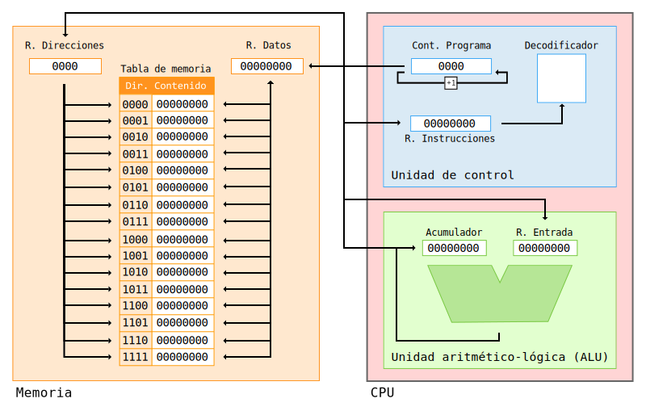

# Von Neumann Simulator

This project simulates the [Von Neumann architecture](https://en.wikipedia.org/wiki/Von_Neumann_architecture), allowing the execution of a 4-bit instruction set. It is an educational project aimed at helping students understand the internal workings of a computer.

The original project was created by [Pedro Guitérrez](https://xitrus.es/VonNeumann/). I have made several modifications to it, expanded the instruction set, added new examples, reorganized the visual interface and added translations (english, spanish and basque).

You can use the simulator at: [https://yuki.github.io/VonNeumann-simulator/](https://yuki.github.io/VonNeumann-simulator/)


# How does it work?

The simulator is divided into three main sections:

- **Memory**: Contains the program to be executed. It has a maximum size of 16 memory addresses.
- **CPU**: Contains:
  - **ALU**: Arithmetic Logic Unit. This is where most of the operations in the instruction set are performed.
  - **Control Unit**: Responsible for controlling and decoding the instructions to be executed.





# Instruction Set

Our CPU is capable of executing 16 instructions (the last one has not been added yet). Arithmetic and logical operations are performed between the **input register** and the **accumulator**, storing the result in the **accumulator**:

- **[0000] Addition**: Performs an addition.
- **[0001] Subtraction**: Performs a subtraction.
- **[0010] Multiplication**: Performs a multiplication.
- **[0011] Exponentiation**: Performs a power operation.
- **[0100] AND Operator**: Performs the bitwise logical **AND** operation.
- **[0101] OR Operator**: Performs the bitwise logical **OR** operation.
- **[0110] Move to Memory**: Moves the accumulator content to the specified memory address.
- **[0111] Halt**: Ends the program.
- **[1000] NOT Operator**: Performs the bitwise logical **NOT** operation on the accumulator content (it is first moved to the data register and then returned to the input register).
- **[1001] Increment +1**: Increments the accumulator value by 1 (it is first moved to the data register and then returned to the input register).
- **[1010] Decrement -1**: Decrements the accumulator value by 1 (it is first moved to the data register and then returned to the input register).
- **[1011] ROL**: Rotates bits to the left, moving the most significant bit to position zero.
- **[1100] ROR**: Rotates bits to the right, moving the least significant bit to the leftmost position.
- **[1101] XOR Operator**: Performs the bitwise logical **XOR** operation.
- **[1110] Reset Accumulator**: Resets the **accumulator** content to 0. Before doing so, its value is stored in the input register.


# Examples

The simulator includes several example programs that can be used to understand how the different instructions work.

- 5 + 11 = 16
- (1 + 1) ^ 5 = 32
- 01001011 OR 01010101 = 01011111
- 01001011 AND 01010101 = 01000001
- 255 + 1 = OVERFLOW
- ((2 ^ 2) + 2) ^ 2 = 36
- (8 - 3) ^ 3 = 125
- NOT(DEC(INC(5))) = 250
- ROR(ROR(ROR(3))) = 96
- 01001011 XOR 01010101 = 00011110
- RST(5+11) = 0


# Upload Your Program!

You can upload your own binary program. The file must be a plain text file (**.txt** file extension), and each line must contain one instruction of 8bit, and a maximum of 16 memory positions.

Example `file.txt`:

```txt
00000100
00000101
01100111
01110000
00000101
00001011
00000000
00000000
```
